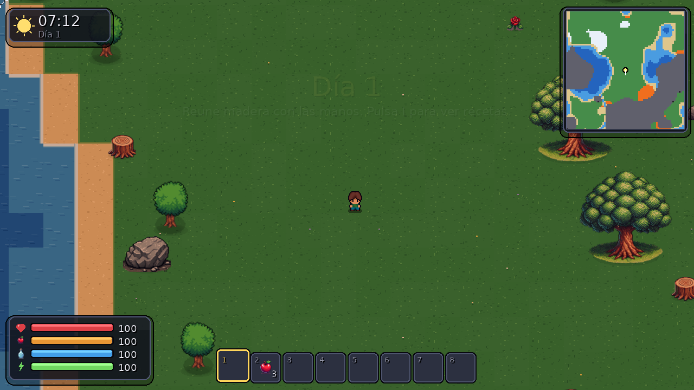

# Faith of Surviving

Juego de supervivencia 2D con vista cenital hecho con **pygame**. Explora un mundo infinito, recolecta
recursos, fabrica herramientas, construye tu refugio y sobrevive a las noches y a las cuevas.



## Ejecutar

```bash
pip install -r requirements.txt     # pygame-ce (o: pip install pygame)
python main.py
```

Requiere Python 3.9 o superior. Las partidas se guardan en `~/.faith_of_surviving/` (Windows: `%APPDATA%\FaithOfSurviving`).

## Controles

| Tecla | Acción |
|---|---|
| `W A S D` / flechas | Moverse |
| `Shift` | Correr (gasta energía y aumenta hambre/sed) |
| `Espacio` | Esquivar con impulso (invulnerable un instante) |
| Clic izquierdo (mantener) | Usar el objeto en mano: golpear, atacar, disparar, comer, colocar |
| Clic derecho (mantener) | Guardia con escudo equipado (−70 % de daño frontal) |
| `E` | Interactuar: cofres, mesas, horno, camas, puertas, agua, cuevas |
| `1`–`8` / rueda | Elegir objeto de la barra rápida |
| `I` / `Tab` | Inventario y fabricación |
| `F` | Comer o beber lo que llevas en la mano |
| `Q` | Soltar el objeto en mano |
| `M` | Silenciar |
| `F3` / `F11` / `Esc` | Depuración / pantalla completa / pausa |

## Cómo se juega

1. **Recolecta** con las manos (lento) o con herramientas. Cada recurso pide una herramienta y un nivel mínimo:
   pico de madera → piedra → pico de piedra → hierro → pico de hierro → oro.
2. **Fabrica** en el inventario (`I`). Las recetas con ‹Mesa› u ‹Horno› requieren tener esa estación a menos de 3 casillas.
3. **Cocina** la carne en un horno: la cruda te hace daño. El hierro y el oro también se funden allí.
4. **Anochece**: salen no-muertos. Con el sol **arden**, así que puedes refugiarte (muros, puertas, vallas) o pelear al amanecer.
5. **Duerme** en una cama por la noche para saltar al amanecer y fijar tu punto de reaparición.
6. **Cuevas**: entra por las bocas en las montañas. Hay hierro, oro, cofres antiguos con botín raro… y más enemigos. Lleva antorchas
   (sostener una antorcha ilumina más que ninguna otra cosa).
7. Si **mueres**, tus objetos quedan en un cofre donde caíste.

## Estructura del código

```
main.py                    punto de entrada
faith/
  game.py                  bucle principal, estados, cámara, guardado/carga, interacción
  settings.py              constantes de ajuste (velocidades, daños, tamaños, colores)
  items.py                 registro de objetos, niveles de herramienta y recetas
  inventory.py             modelo de inventario (lógica pura, probada con unittest)
  crafting.py              lógica de fabricación
  assets.py / audio.py     caché de imágenes / efectos de sonido sintetizados
  save.py                  guardado JSON atómico
  world/
    terrain.py             terreno procedural (ruido determinista por semilla)
    tiles.py               texturas procedurales y horneado de chunks
    level.py               Level / Overworld / Cave: colisiones, spawns, dibujo
    cavegen.py             generador de cuevas (autómata celular + flood fill)
    objects.py             árboles, rocas, minerales, cofres antiguos
    structures.py          mesa, horno, cofre, cama, puertas, muros, antorchas…
  entities/
    player.py              movimiento, supervivencia, combate, animaciones
    mobs.py                enemigos y animales (IA por estados)
    projectile.py / drops.py
  fx/                      partículas, iluminación día/noche, clima
  ui/                      HUD, inventario, menús, minimapa, widgets
tests/                     unittest + pruebas de integración y fuzz
```

## Qué cambió respecto a la versión original

- **Arquitectura:** de módulos acoplados con estado global a un paquete con responsabilidades claras. Los datos
  (objetos, recetas, especies) están en tablas, no repartidos por el código.
- **Rendimiento:** el suelo se hornea una vez por chunk (antes se dibujaba tile a tile cada fotograma); sombras, tintes
  y escalados cacheados; la capa de luz se calcula a 1/4 de resolución; assets de 40 MB → 3,7 MB; minimapa incremental.
- **Mundo:** infinito, con biomas (hierba, arena, nieve, agua, montañas, lava), ríos y cuevas generadas por semilla;
  los objetos recolectados persisten al guardar.
- **Jugabilidad:** niveles y durabilidad de herramientas, guardia y esquiva, arco, armadura con defensa, hambre/sed/energía,
  cocina, camas, tumbas al morir, objetos que caen al suelo con imán de recogida.
- **Enemigos:** cinco tipos con comportamientos distintos (cuerpo a cuerpo, a distancia, volador) y siete animales;
  los ataques tienen aviso visual y los no-muertos arden con el sol.
- **Gráficos y animación:** ciclo día/noche con iluminación dinámica, antorchas, lava luminosa, clima, partículas,
  números de daño, temblor de cámara, animaciones de golpe sincronizadas con el impacto.
- **Interfaz:** HUD rediseñado, inventario con arrastrar y soltar, fabricación por categorías, cofres, menús.

## Pruebas

```bash
python -m unittest discover -s tests          # lógica pura (inventario, recetas, mundo, cuevas)
python tests/integration_gameplay.py          # talar, fabricar, noche y enemigos
python tests/integration_systems.py           # estructuras, cofres, combate, cuevas, guardado, muerte
python tests/fuzz.py 1 2000                   # entradas aleatorias buscando excepciones
```

Las pruebas de integración usan un sustituto mínimo de pygame (`tests/pygame_shim`, basado en Pillow + numpy) para
ejecutarse sin ventana; no hace falta para jugar.

## Créditos

Los sprites (personaje, animales, enemigos, objetos) provienen del proyecto original; revisa sus licencias antes de
redistribuirlos. Los sonidos se sintetizan en tiempo de ejecución.
